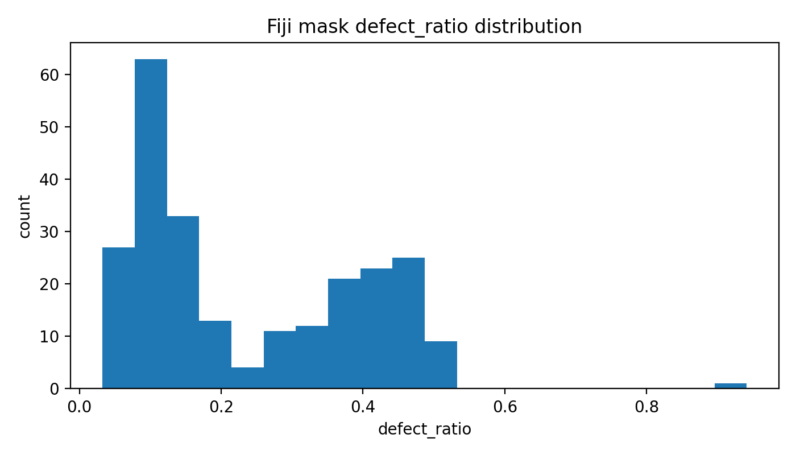
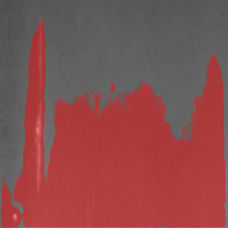
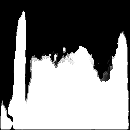

# Smart Defect Inspector

Smart Defect Inspector is an end-to-end computer vision and image analysis project designed to demonstrate practical ML engineering, classical image processing, and reproducible experimentation workflows.

The project simulates a real-world defect inspection pipeline used in industrial quality control, materials analysis, and imaging-based diagnostics.

It integrates:

- Classical image processing (OpenCV, Fiji/ImageJ)
- Deep learning (YOLOv8, U-Net)
- Segmentation and detection workflows
- Experiment tracking with SQLite
- Automated reporting and visualization

---

##  Key Capabilities

✔ Image preprocessing & enhancement  
✔ Defect detection (YOLOv8)  
✔ Pixel-level segmentation (U-Net)  
✔ Classical CV baseline (Fiji/ImageJ)  
✔ Mask analytics & defect quantification  
✔ Reproducible experiment tracking (SQLite)  
✔ CSV metric export & leaderboard generation  

---

##  Project Motivation

Modern inspection systems require a hybrid approach combining:

- Classical computer vision techniques
- Deep learning models
- Quantitative validation
- Reproducible experiment management

This project demonstrates how these components interact within a structured ML pipeline.

---

##  Tech Stack

- Python
- OpenCV
- PyTorch
- Ultralytics YOLOv8
- Fiji / ImageJ
- SQLite
- Matplotlib

**Summary:**  
Raw images → Preprocessing → Classical CV baseline (Fiji) → DL detection (YOLO) → DL segmentation (U-Net) → Metrics → SQLite logging → Reports


## Quickstart

### 1) Install dependencies
```bash
pip install -r requirements.txt

### Run full demo pipeline

```bash
python run_all.py

This executes:

- Smoke test image generation
- Dataset scaffold
- Preprocessing + SQLite logging
- SQL query display
- Preprocessing visualization
- Synthetic mask generation
- Segmentation overlay + logging


## Pipeline (so far)

1. Generate a sample image  
   `python -m src.utils.smoke_test`

2. Preprocess the image + log metrics to SQLite  
   `python -m src.preprocess.demo_preprocess`

3. Query latest runs + metrics  
   `python -m src.db.query_latest_runs`

4. Save a before/after comparison figure  
   `python -m src.eval.visualize_preprocess`

5. Run YOLOv8 inference on the example image (saves overlay + logs to SQLite)  
   `python -m src.detection.infer_yolo`

6. Generate a synthetic segmentation mask (ground truth)  
   `python -m src.segmentation.make_synthetic_mask`

7. Visualize mask overlay + log mask stats to SQLite  
   `python -m src.segmentation.visualize_mask_overlay`


## Generated outputs

- `outputs/smoke_test.png`
- `outputs/smoke_test_preprocessed.png`
- `outputs/preprocess_comparison.png`
- `outputs/experiments.sqlite` (runs + metrics)
- `outputs/yolo_example_pred.png`
- `data/processed/masks/example_mask.png`
- `outputs/segmentation_mask_overlay.png`

## Project Purpose

Smart Defect Inspector demonstrates an end-to-end computer vision workflow for:

- Image preprocessing
- Defect detection
- Defect segmentation
- Experiment tracking
- Visual reporting

Designed as a portfolio + applied ML engineering project.

## Dataset Inspection (Fiji/ImageJ)

Raw NEU-DET images were inspected using Fiji for:

- Contrast/illumination analysis
- Noise characteristics
- Defect morphology understanding

## Reproducible Reports

Experiment runs, metrics, and image analysis outputs are stored in:

- `outputs/experiments.sqlite`

Metrics can be exported to CSV:

```bash
python -m src.db.export_metrics_csv


Fiji / ImageJ Classical CV Baseline

This project integrates Fiji (ImageJ) for classical image analysis:

Classical segmentation workflow

Open image in Fiji

Apply thresholding / filtering

Convert to Mask

Save mask → data/processed/fiji_masks/

Batch mask generation

Fiji macros are used for automated mask creation across datasets.

Python integration

Generated masks are:

Loaded into Python

Overlaid on images

Quantified (defect ratio, pixel stats)

Logged into SQLite experiment tracker

This enables:

Classical vs ML/DL comparison

Reproducible validation

Hybrid CV workflows


### Fiji defect ratio distribution (from SQLite)


### U-Net Segmentation (trained on Fiji masks)


Predicted mask:


## Results (current)

- U-Net (trained on Fiji masks): Dice vs Fiji mask ≈ Dice vs Fiji: 0.8652

## U-Net Inference Leaderboard (SQLite → CSV)

Export a leaderboard of U-Net inference runs (Dice/IoU vs Fiji masks):

```bash
python -m src.segmentation.export_unet_leaderboard

Output:

outputs/unet_leaderboard.csv


## Quick “Top 5” preview
head -n 6 outputs/unet_leaderboard.csv


